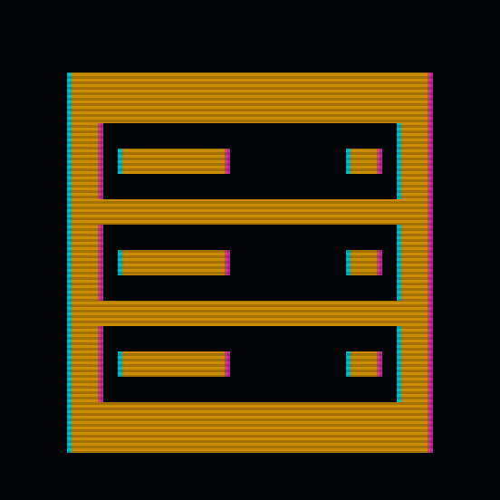

<p align="center">
  
</p>

# unraid-mcp

Production-grade Python MCP server for the Unraid GraphQL API.

## Status

**Alpha**, v0.1.0. Stage: S3 (complete: full tool surface with live integration tests, distributed source-only). See [CLAUDE.md](CLAUDE.md) for the architectural overview.

## Features

- **MCP tools** covering Unraid system info (including flash drive, registration, and Unraid Connect status), array, disks, Docker, VMs, shares, the authenticated user account, notifications, and parity checks
- **Read/write mode separation**: write tools invisible in readonly mode (`mcp.disable(tags={"write"})`) with runtime defense-in-depth
- **Single-endpoint GraphQL client**: `httpx` async client over the Unraid `/graphql` endpoint with `tenacity` retry and typed error mapping
- **Typed, linted, tested**: strict ty, ruff, pytest with CI on Python 3.13

### Removed in this release

Unraid 7.2+ removed `Query.users`, `addUser`, and `deleteUser` from the GraphQL API, so this MCP server can no longer expose them. The previous `unraid_list_users`, `unraid_create_user`, and `unraid_delete_user` tools have been dropped, along with the `UNRAID_ALLOW_USER_MUTATIONS` and `UNRAID_NEW_USER_*` environment variables. A new read-only `unraid_get_me` tool replaces `unraid_list_users` by returning the single `UserAccount` matching the API key in use via `Query.me`.

## Quick Start

```bash
# Install from source
git clone https://github.com/millsymills-com/unraid-mcp.git
cd unraid-mcp
uv sync

# Or, install directly from git into another project's venv
uv pip install git+https://github.com/millsymills-com/unraid-mcp.git

# Configure
cp .env.example .env
# Edit .env with your Unraid host and API key

# Run
unraid-mcp
```

Generate an API key in the Unraid WebGUI under **Settings → Management Access → API Keys**, or from a terminal on the server with `unraid-api apikey --create`. Enable the GraphQL API the first time via **Settings → Management Access → Developer Options**.

Once configured, run `unraid-mcp --check-config` to verify connectivity before attaching an MCP client; it prints the resolved config (with the API key redacted), runs a single validation query, and exits 0 / 1 / 2 (ok / no key / validation failed).

Before re-deploying against a new Unraid release, run `unraid-mcp --check-schema` to pre-flight upgrade compatibility; it introspects the live GraphQL schema and reports any drift from what this client expects to query. Exit codes are `0` (schema compatible), `1` (no API key configured), and `2` (drift detected or connection failure). Sample drift output:

```
Detected 2 schema-drift issue(s):
  • Query.docker.containers: missing field `autoStart`
  • Mutation.array.startArray: argument `force` removed
```

### Continuous schema drift check (CI)

The [`.github/workflows/schema-probe.yml`](.github/workflows/schema-probe.yml) workflow runs `unraid-mcp --check-schema` nightly (`0 7 * * *` UTC) against a live Unraid server held in repository secrets. CI tracks against the latest Unraid stable release. Forks that want the probe to run must set two Actions secrets (with three optional overrides):

```
UNRAID_HOST            # required: hostname or IP of a reachable test server
UNRAID_API_KEY         # required: API key on that server
UNRAID_PORT            # optional: overrides the default port
UNRAID_USE_HTTPS       # optional: "true" / "false"
UNRAID_VERIFY_SSL      # optional: "true" / "false", leave default unless using a self-signed cert
```

The probe step is skipped automatically when the two required secrets are absent, so forks that don't have a test server see no failures. To opt out entirely, disable the workflow on your fork:

```bash
gh workflow disable "Schema Probe"
```

## Operational notes

- **Read-only by default.** `UNRAID_MODE` defaults to `readonly`; write tools (start/stop/restart, parity controls) are hidden until you set `UNRAID_MODE=readwrite`. The mode is also re-checked at call time, so a forgotten env var can't quietly expose writes.
- **TLS verification on by default.** `UNRAID_VERIFY_SSL=true`. Set it to `false` only on trusted networks with self-signed certs; a forged cert can intercept your API key and proxy mutations through your client.
- **GraphQL must be enabled in Unraid.** The endpoint at `/graphql` is gated behind **Settings → Management Access → Developer Options** in the Unraid WebGUI; enable it once per server before the MCP client connects.

## MCP client setup

`unraid-mcp` speaks MCP over stdio. Point any compatible client at the installed console script and pass your Unraid settings through the `env` block.

### Claude Desktop

Edit `~/Library/Application Support/Claude/claude_desktop_config.json` (macOS) or `%APPDATA%\Claude\claude_desktop_config.json` (Windows):

```jsonc
{
  "mcpServers": {
    "unraid": {
      "command": "unraid-mcp",
      "env": {
        "UNRAID_HOST": "tower.local",
        "UNRAID_API_KEY": "your-key-here",
        "UNRAID_MODE": "readonly"
      }
    }
  }
}
```

If you installed from source into a venv, use the venv's python explicitly:

```jsonc
{
  "mcpServers": {
    "unraid": {
      "command": "/path/to/.venv/bin/unraid-mcp",
      "env": { "UNRAID_HOST": "tower.local", "UNRAID_API_KEY": "your-key-here" }
    }
  }
}
```

### Cursor

Edit `~/.cursor/mcp.json` (or via **Settings → MCP → Add new MCP Server**):

```jsonc
{
  "mcpServers": {
    "unraid": {
      "command": "unraid-mcp",
      "env": {
        "UNRAID_HOST": "tower.local",
        "UNRAID_API_KEY": "your-key-here"
      }
    }
  }
}
```

### Continue.dev

In `.continue/config.json`:

```jsonc
{
  "experimental": {
    "modelContextProtocolServers": [
      {
        "transport": {
          "type": "stdio",
          "command": "unraid-mcp",
          "env": {
            "UNRAID_HOST": "tower.local",
            "UNRAID_API_KEY": "your-key-here"
          }
        }
      }
    ]
  }
}
```

### Claude Code (terminal)

```bash
claude mcp add unraid -- unraid-mcp
```

Then set env vars in the same shell, or use `claude mcp add unraid --env UNRAID_HOST=tower.local --env UNRAID_API_KEY=...`.

### Enabling write tools

The server starts in read-only mode by default. To expose the `start/stop/restart` family, set `UNRAID_MODE=readwrite` in the client's `env` block.

## Running in Docker

A [`Dockerfile`](Dockerfile) is included for operators who prefer containerized deployment. Build with:

```bash
docker build -t unraid-mcp:latest .
```

Because MCP is a stdio protocol, the container is meant to be launched *per MCP session*; the client spawns `docker run -i` on demand. Example Claude Desktop config pointing at the container:

```jsonc
{
  "mcpServers": {
    "unraid": {
      "command": "docker",
      "args": [
        "run", "-i", "--rm",
        "-e", "UNRAID_HOST",
        "-e", "UNRAID_API_KEY",
        "-e", "UNRAID_MODE",
        "unraid-mcp:latest"
      ],
      "env": {
        "UNRAID_HOST": "tower.local",
        "UNRAID_API_KEY": "your-key-here",
        "UNRAID_MODE": "readonly"
      }
    }
  }
}
```

Run `--check-config` against the built image the same way:

```bash
docker run -i --rm \
    -e UNRAID_HOST=tower.local \
    -e UNRAID_API_KEY=your-key \
    unraid-mcp:latest --check-config
```

Pre-flight schema compatibility against the built image:

```bash
docker run -i --rm \
    -e UNRAID_HOST=tower.local \
    -e UNRAID_API_KEY=your-key \
    unraid-mcp:latest --check-schema
```

## Configuration

See [.env.example](.env.example) for all configuration options.

| Variable | Default | Description |
|----------|---------|-------------|
| `UNRAID_MODE` | `readonly` | `readonly` or `readwrite` |
| `UNRAID_HOST` | `tower.local` | Unraid server hostname or IP |
| `UNRAID_PORT` | `443` | HTTPS port for the API |
| `UNRAID_USE_HTTPS` | `true` | Use HTTPS (set false for plain HTTP) |
| `UNRAID_API_KEY` | _(required)_ | API key from Unraid WebGUI |
| `UNRAID_VERIFY_SSL` | `true` | Verify TLS cert. Set `false` only for self-signed LAN certs (accepts MITM risk). |

## Development

```bash
# Install with dev dependencies
uv sync --extra dev

# Lint and format
uv run ruff check src/ tests/
uv run ruff format --check src/ tests/

# Type check
uv run ty check src/unraid_mcp/

# Test
uv run pytest tests/unit/ -v

# Pre-commit hooks
uv run pre-commit install
```

## License

Apache-2.0. See [LICENSE](LICENSE).
